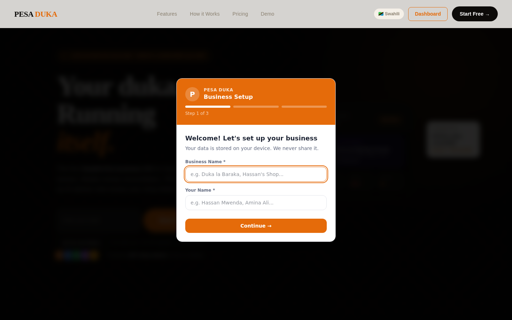

# Pesa Duka — The Business Brain for East Africa

**An all-in-one point-of-sale, inventory, and bookkeeping platform for small shop owners — built for East African regulatory requirements first, with Canadian small-business compliance as a second market.**

[]()
[]()



---

## What this is

Pesa Duka ("money shop") gives independent shop owners the tools larger retail chains have — point of sale, inventory tracking, supplier management, and bookkeeping — with East African tax compliance built in from the start, not bolted on later.

The standout feature: an **EFD Z-Report generator** for Tanzania Revenue Authority (TRA) fiscal compliance — daily end-of-day fiscal summaries, EFD serial number tracking, TIN integration, VAT (18%) calculation, and receipt tracking, aimed at the mandatory compliance requirement for any business doing TZS 14M+ in annual turnover. This is a genuine, specific regulatory differentiator, not a generic feature.

The repo also contains Canadian small-business market research, suggesting a second target market: Canada's immigrant-entrepreneur small business segment.

---

## Core Features

- **Point of Sale (POS)** — transaction handling at the counter
- **Inventory management** — stock tracking
- **Cashbook** — day-to-day bookkeeping
- **Supplier management**
- **Customer management**
- **Team management** — staff/role handling
- **Reports** — business performance reporting (charts via Recharts)
- **EFD Z-Report Generator** — TRA fiscal compliance (Tanzania)
- **Business Tools** — additional utilities beyond core POS/bookkeeping

---

## Tech Stack

| Layer | Technology |
|---|---|
| Frontend | React + Vite |
| UI | Radix UI + MUI (mixed — worth standardizing on one eventually) |
| Charts | Recharts |
| Styling | Emotion |

---

## Getting Started (Local Dev)

### Prerequisites
- Node.js 18+

### Installation

```bash
git clone https://github.com/creova-gif/pesa-duka.git
cd pesa-duka
npm install
npm run dev
```

---

## Roadmap / Status

- [x] Core POS, inventory, cashbook, supplier, customer, team modules
- [x] Tanzania EFD Z-Report compliance feature
- [ ] Canada market entry — currently research-stage (`CANADA_MARKET_RESEARCH.md`), not yet reflected in shipped compliance features
- [ ] Repo rename to match product name

---

## Contributing

This is a private, proprietary CREOVA product. External contributions are not accepted at this time.

## License

Proprietary — All Rights Reserved. See `LICENSE`.

## Credits

Built by CREOVA. Product lead: Justin Mafie.
